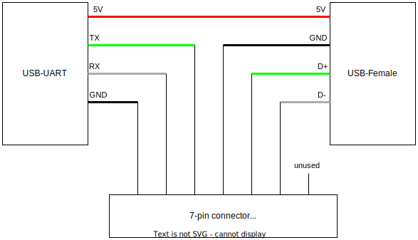

# SN1000 Documentation

1. [Setup](#setup)
	1. [xnsocadmin](#xnsocadmin)
	2. [Serial Connection](#serial-connection)
		1. [USB-uart Adapter](#usb-uart-adapter)
		2. [OS installation](#os-installation)
2. [MISC](#MISC)
3. [Connect to the soc inside a vm](#connect-to-the-soc-inside-a-vm)
4. [Firmware/driver versions](#firmware/driver-verisons)

## Setup
The card has 2 ports. Port 1 is used for management and port 2 is for ethernet. When only port 1 is connected the speed is slow, but when both ports are connected, they are somehow equally fast.

By default the SN1000 card do not have any OS installed, it can only boot in maintenance mode.

In order to do anything with the card other than simple ethernet, OS must be installed first.

### xnsocadmin
`xnsocadmin` is an execuable provided by Xilinx to manage the card. It's statically linked and can be used separately, but it sometimes sigfaults on NixOS. Worked fine on Ubuntu 20.04 though.

### Serial Connection
The maintenance OS somehow does not pick up usb connection before actual OS installation. Before that, only serial connection is possible.

#### USB-uart Adapter
To establish serial connection, you'll need a usb-uart adapter cable as shown in the diagram first.
Some uart adapter might have compatibility issue, the reason is unknown yet.
The USB-female header is used to connect usb pheripheral devices to the SN1000 card, such as USB-ethernet adapter or USB drives. Note that it can only work at about 100 mbps (still a lot faster than serial).



#### OS installation
After connecting the cable to the card, a tty device will appear as `/dev/ttyUSBx`. If there are more than one device available, you'll need to find out which device is correct by e.g. `lsusb`. Here we assume the correct device is `ttyUSB0`.

1. To make the actual connection, run:

```
# picocom /dev/ttyUSB0 -b 115200
```

- Make sure the terminal is using the correct configuration:
    - databits: 8
    - stopbits: 1
    - parity: none
    - baudrate: 115200
- For unknown reason in `minicom` only RX works, nothing can be sent. Use picocom instead.

2. After that, open another terminal on the host and boot the card into maintenance mode:
```
# xnsocadmin ioctl.char=/dev/ttyUSB0 maintenance
```
- Note: this(ioctl.char) sometimes does not work. If this is the case, try the other method in the last section.

3. You will see outputs in picocom at the same time. After the device is correctly booted, login into the maintenance kernel with root(password: root)

4. In the picocom terminal, send the boot image via serial. You can download the boot image from Xilinx's website, e.g. `XN-200576-LS-3-Alveo SN1000 ARM SDK update image.zip`
- Press `<C-A><C-S>`, then type the filename you want to send. It is recommended to put the zip file directly into `/tmp` directory (you can do that by first cd to it then start transfer).
- The transfer is very slow (about 11 kB/s), so make sure your session can run in the background (e.g. in tmux). Typically a full transfer of the aforementioned image lasts about 18 - 20 hours.

5. When the transfer is complete, extract the zip file, then run the command in the picocom terminal:
```
# update_maintenance --image-path /tmp/boot_mmc1.tgz
```
- It is recommended to verify checksum before proceeding.

6. After the installation is complete, the serial console will be disabled by the kernel, you can only access the soc via ssh or xnsocadmin.
Now connect a ethernet adapter to the cable via the USB-female header and connect it to somewhere reachable e.g. host.

7. Configure network for the main OS.
- Create a file `01-netcfg.yaml` with following content:
```
network:
    version: 2
    renderer: networkd
    ethernets:
        fsl:
            match:
                name: enp1s0f0
            dhcp4: no
            addresses:
                - 192.168.1.1/24
        usb:
            match:
                name: usb0
            dhcp4: yes
```
- If the place you connected the adapter to does not have dhcp enabled, assign a ip address to the usb0 interface manually.
- Update the configuration file to the soc.
```
# xnsocadmin --verbose ioctl.char=/dev/ttyUSB0 config network 01-netcfg.yaml
```
- Note: as mentioned before, this sometimes does not work. If this is the case, try the other method in the last section.

8. Configure network for maintenance OS, in case it's need later.
- Create a file `interfaces` with following content:
```
auto enp1s0f0
iface enp1s0f0 inet static
address 192.168.1.1
netmask 255.255.255.0
auto usb0
iface usb0 inet dhcp
```
- Same holds for the usb interface.
- Update the configuration
```
xnsocadmin --verbose ioctl=eth1 config network_maint interfaces
```

9. Reboot the whole system and assign an ip address to the interface inside the same subnet, and you should be able to login into the main OS with root (password: root)

10. Verify that you are running main OS instead of maintenance OS:
```
# sudo xnsocadmin ioctl.char=/dev/ttyUSB0 status

SOC State Information
    Run State:            OS_RUNNING

SOC Version Information
    Boot:               1.3.1.0000
    uboot:              1.3.1.0000
    Main rootfs:        1.3.1.0000
    Recovery buildroot: 1.3.1.0000
```

## MISC
Note that up until now we are either working inside a vm or through the usb cable. To make the card work bare metal, we still need to patch the dkms driver, porting it to a newer version of the kernel. Or just simply run old kernel instead (the problem with old kernel is that a lot of features are not available there).

## Connect to the soc inside a vm

1. First make sure that iommu is enabled.

2. Find the card's pci address and bind it to vfio-pci
```
# lspci -d 10ee:0100
27:00.0 Ethernet controller: Xilinx Corporation Device 0100
27:00.1 Ethernet controller: Xilinx Corporation Device 0100
```
- There might be more than one available, bind all of them to vfio-pci if this is the case.
- You can use the [script](bind_device.sh) in the repo to bind device.

3. Create a Ubuntu vm with kernel version at around 5.4. Ubuntu 20.04.5 worked fine for testing. Then passthrough the pcie device. Example launching script:
```shell
qemu-system-x86_64 \
    -nic user,hostfwd=tcp::10022-:22 \
    -drive file=ubuntu.qcow2,format=qcow2 \
    -m 32G \
    -cpu host \
    -smp 16 \
    -enable-kvm \
    -device vfio-pci,host=27:00.0 \
    -device vfio-pci,host=27:00.1
```

4. Download and install the dkms driver from Xilinx's website, e.g. `XN-200324-LS-3-Alveo_SN1000_NET_driver_source_Debian_package.zip`.

5. Make sure that correct kernel module is loaded (version should be the same as the dkms package):
```
# modprobe -r sfc && modprobe sfc && modinfo sfc
filename:       /lib/modules/5.4.0-148-generic/updates/dkms/sfc.ko
version:        5.3.11.1000
...
```

6. Find the net device, note that it will have different address as in the host: 
```shell
# lspci -d 10ee:0100
00:04.0 Ethernet controller: Xilinx Corporation Device 0100
00:05.0 Ethernet controller: Xilinx Corporation Device 0100

# ls /sys/bus/pci/devices/0000:00:04.0/net
ens4

# ls /sys/bus/pci/devices/0000:00:05.0/net
ens5
```
- The two ports might be different on boot, so try the other if one is not working.

7. Do the steps in the previous sections, but replace the command of xnsocadmin with following:
```
# xnsocadmin ioctl=ens4 maintenance
```

## Firmware/driver versions

Linux version 5.4 (and some later ones) work with xlinx provided dkms driver (updating firmware and everything works, contains vDPA code). 

Linux version 5.9 got the driver driver upstreamed. It supports internet only (no firmware updating, no vDPA code). 

We have xilinx dmks driver patches for example for 5.15. It can install new firmware, but some things like ARM SOC access doesn't work. 
